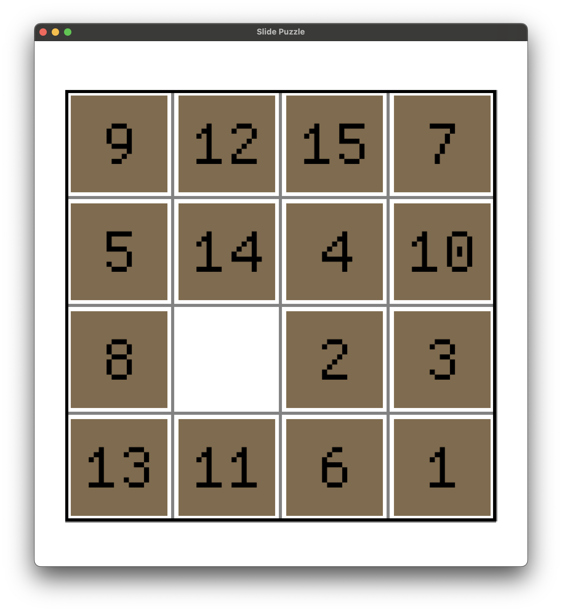

# Slide Puzzle

A slide puzzle game implemented in Rust.



## How to Run

```bash
cargo run
```

## Controls

- Click on tiles adjacent to the empty space to move them
- Goal: arrange numbers in order from 1

## Dependencies

- macroquad: Game engine
- rand: Puzzle shuffling functionality
